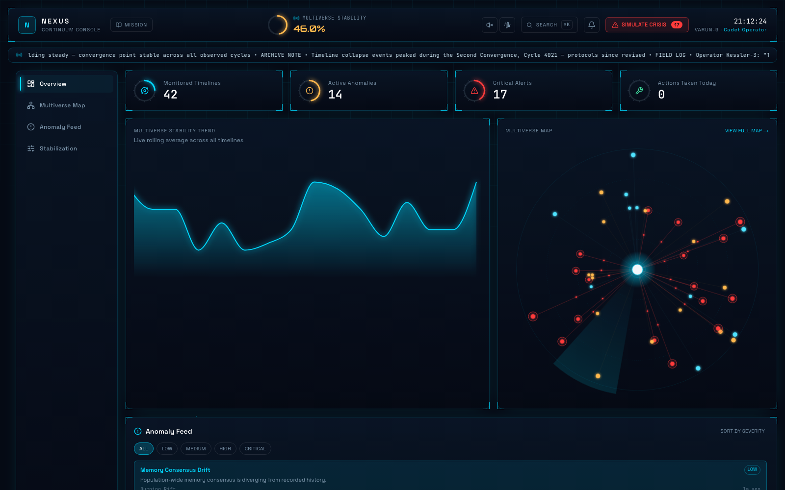
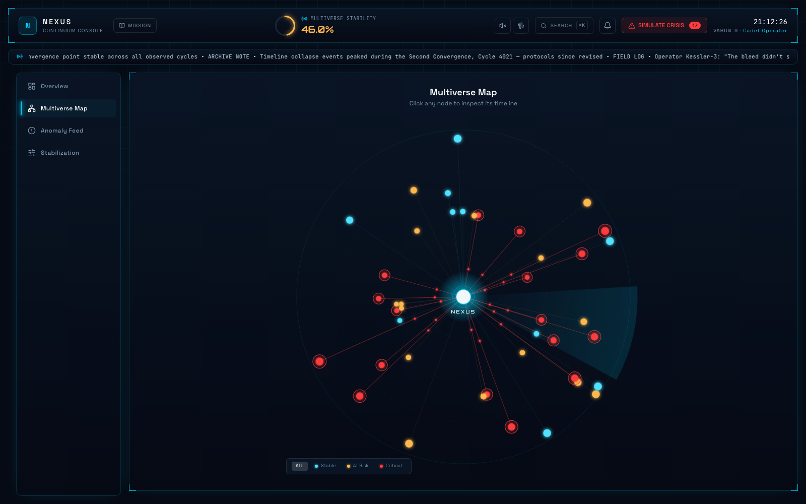
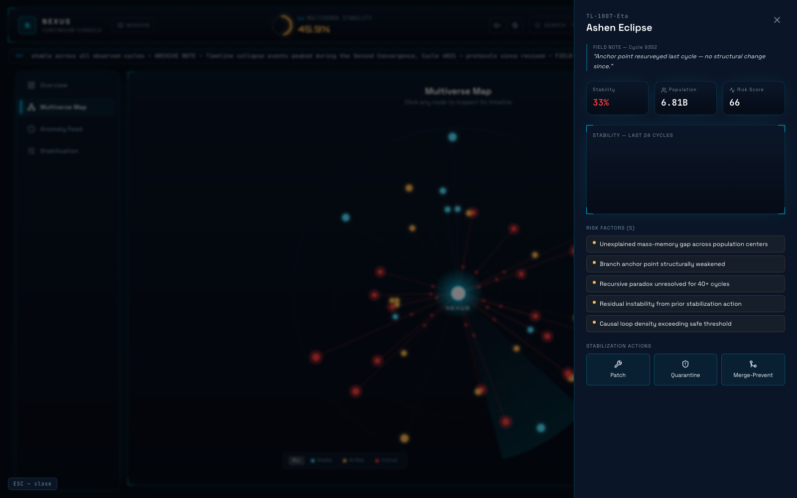
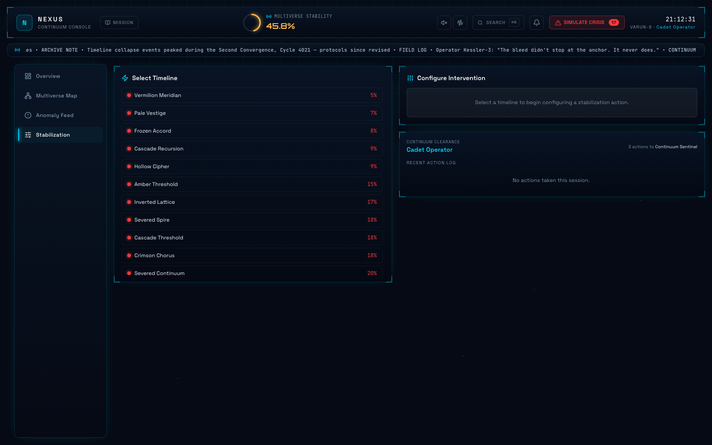
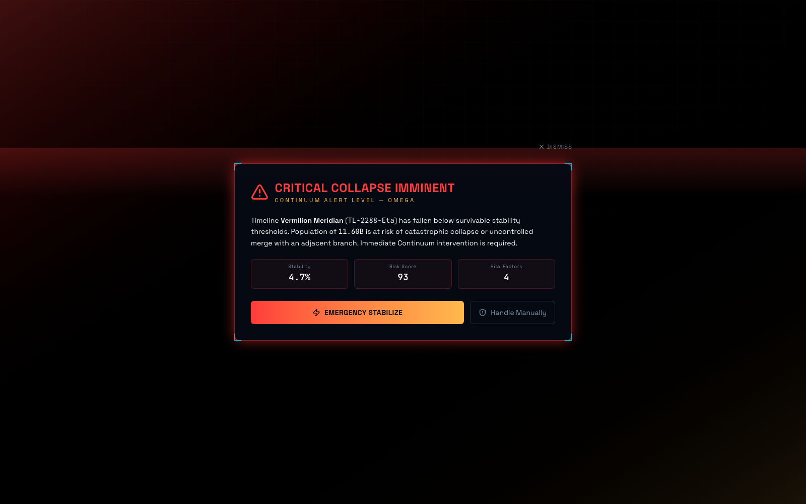
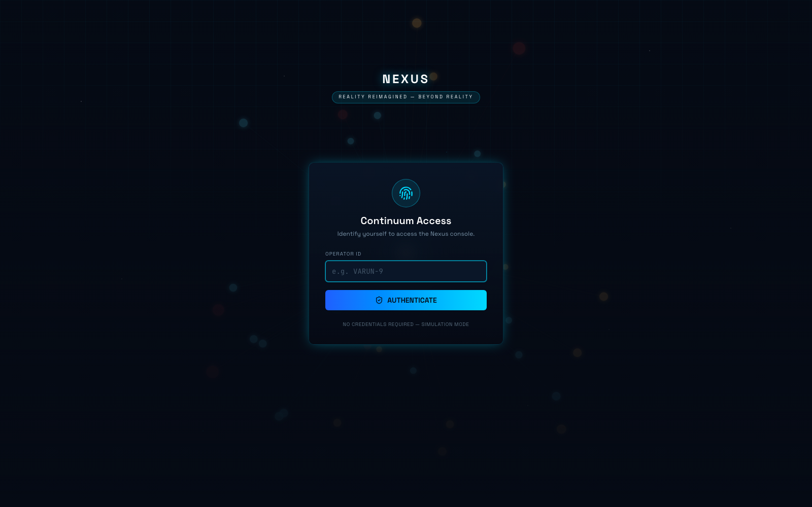
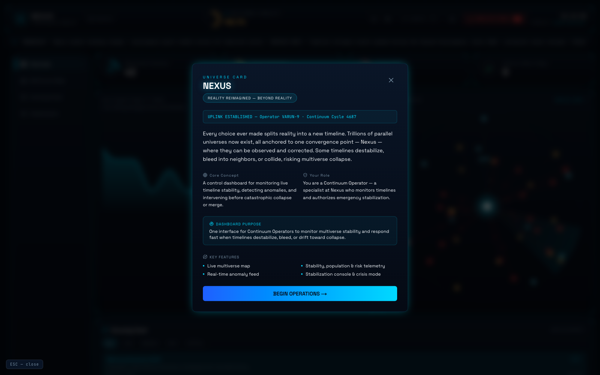
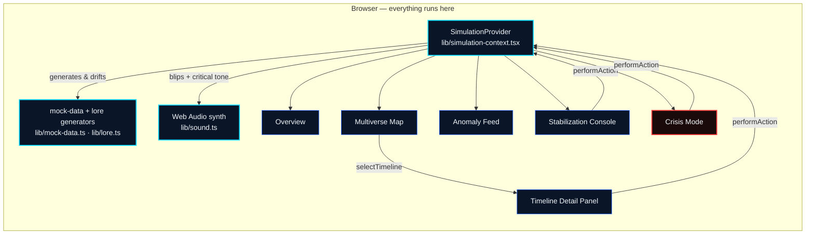

<div align="center">

# 🛰️ NEXUS
### Continuum Authority Console — *Deep Space HUD Edition*

[](https://git.io/typing-svg)

[](https://nexus-multiverse.vercel.app)
[](https://vercel.com)
[](https://claude.com/claude-code)

</div>

---

## 📡 The story

Every choice ever made splits reality into a new timeline. Trillions of parallel universes now exist, all anchored to one convergence point — **Nexus** — where they can be observed and corrected before they're lost.

Left unattended, timelines don't just sit still. Causal loops compound. Entropy inverts. Populations lose consensus with their own recorded history. Branch anchors weaken cycle over cycle until a timeline crosses the line between *unstable* and *unrecoverable*. When that happens, Nexus doesn't wait for a human to notice — **Continuum Alert Level Omega** triggers on its own, and the console goes to full crisis footing until someone stabilizes it.

You are a **Continuum Operator**. This console is the only thing standing between order and a very quiet, very permanent kind of silence.

> *"You stop thinking of them as numbers. Then you stop sleeping."* — Operator Aris-6

---

## 🎬 See it live

**➡ [nexus-multiverse.vercel.app](https://nexus-multiverse.vercel.app)** — no login required, skip the boot sequence, drop any Operator ID.

<div align="center">

<sub>Overview — live stability trend, radial gauges, and a preview of the Multiverse Map</sub>
</div>

<br/>

<table>
<tr>
<td width="50%">

<sub>Multiverse Map — radar sweep, orbital rings, critical-only pulse</sub>
</td>
<td width="50%">

<sub>Timeline Detail — field notes, risk factors, one-click intervention</sub>
</td>
</tr>
<tr>
<td width="50%">

<sub>Stabilization Console — configure and confirm an intervention</sub>
</td>
<td width="50%">

<sub>Crisis Mode — Continuum Alert Level Omega</sub>
</td>
</tr>
<tr>
<td width="50%">

<sub>Continuum Access — operator authentication</sub>
</td>
<td width="50%">

<sub>Mission Briefing — personalized uplink, on demand or on first login</sub>
</td>
</tr>
</table>

---

## ⚡ Features

| | |
|---|---|
| 🗺️ **Live Multiverse Map** | Radar-console node graph — orbital rings, a slow rotating sweep, and a traveling light pulse along every critical connector line |
| 📈 **Real-time telemetry** | Stability trend chart that auto-scales to actual volatility, radial gauges, animated counters — nothing snaps, nothing sits static |
| 🚨 **Anomaly Feed** | Severity-ranked, filterable, live-scrolling feed of detected anomalies as they're generated |
| 🛠️ **Stabilization Console** | Patch / Quarantine / Merge-Prevent, with intensity and containment sliders and a satisfying confirm-and-resolve flow |
| 🆘 **Crisis Mode** | Full-screen Omega-level takeover — glitch transition, urgent context, one clear call to action. Triggers manually or organically |
| 🔍 **Command Palette** | `⌘K` / `Ctrl+K` to jump to any timeline or screen instantly |
| 🔔 **Notification Center** | Combined anomaly + action feed in one glanceable dropdown |
| 🎖️ **Operator Rank** | Progress from *Cadet Operator* to *Nexus Custodian* as you actually take stabilization actions |
| 🔊 **Synthesized audio** | Sonar-style blips and a harsher critical tone, generated live via Web Audio oscillators — zero audio files, muted by default |
| 📜 **Continuum Broadcast** | A persistent ticker of in-universe archive notes, field logs, and directives — the world keeps talking even when you're not looking |

---

## 🧩 Tech stack

<div align="center">


</div>

| Layer | Choice | Why |
|---|---|---|
| Framework | **Next.js 16** (App Router, Turbopack) | Fast dev loop, zero-config production build, one-command Vercel deploy |
| Language | **TypeScript** | Every timeline, anomaly, and action is a typed shape — no `any` drifting through the simulation |
| Styling | **Tailwind CSS 4** | Theme tokens (`@theme inline`) drive the entire Deep Space HUD palette from one file |
| Motion | **Framer Motion** | Every live-data transition, panel slide, and micro-interaction — reserved for *live* and *critical* states only |
| Charts | **Recharts** | Stability trend, auto-scaled to real volatility instead of a flat fixed axis |
| Icons | **Lucide React** | Consistent line-icon set across the whole console |
| Audio | **raw Web Audio API** | Sonar blips and the critical tone are synthesized oscillators at runtime — no shipped audio assets |
| Fonts | **Space Grotesk · JetBrains Mono · Orbitron** | UI labels, data/numeric readouts, and HUD hero text, respectively |
| Deploy | **Vercel** | Production builds, previews, and the live demo link above |

---

## 🧠 How it's wired



There is no backend. `SimulationProvider` is the single source of truth — timelines drift on an interval, anomalies spawn probabilistically, the stability trend derives from the live average, and every screen reads from and writes back to that one context. Swap the generator functions for a WebSocket feed and the rest of the app doesn't need to change.

---

## 🚀 Running it locally

```bash
npm install
npm run dev
```

Open [http://localhost:3000](http://localhost:3000). Skip the boot sequence if you're in a hurry, drop any Operator ID (no real auth — simulation mode), and you're in.

```bash
npm run build   # production build
npm run start   # serve the production build locally
```

---

## 📁 Project structure

```
app/                  Next.js App Router entry (boot → login → dashboard)
components/           All UI — Header, MultiverseMap, CrisisMode, RadialGauge, ...
lib/
  ├─ simulation-context.tsx   the one source of truth: state + intervals + actions
  ├─ mock-data.ts             timeline / anomaly / action generators
  ├─ lore.ts                  broadcast lines, field notes, operator rank tiers
  ├─ sound.ts                 Web Audio oscillator synthesis
  ├─ format.ts                colors, formatters, status → style mappings
  └─ types.ts                 Timeline / Anomaly / ActionLogEntry shapes
docs/screenshots/     README imagery
```

---

<div align="center">

**NEXUS** · Continuum Authority — Nexus Operations Division

<sub>Built for a 48-hour hackathon. No timelines were harmed in the making of this console — several were, however, quarantined.</sub>

</div>
